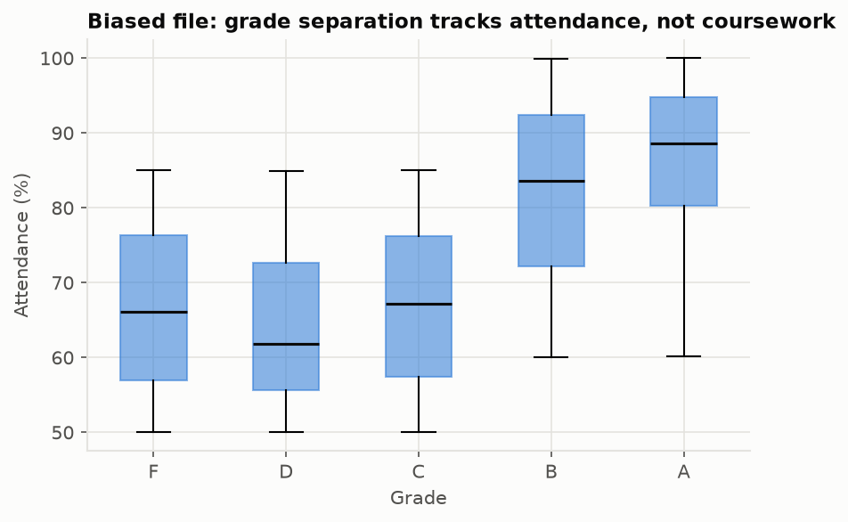
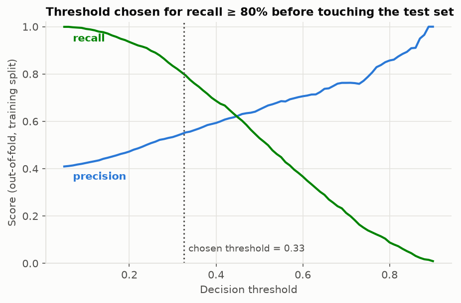

# Write-up — Student At-Risk Prediction

## What I found before modeling

The Kaggle [Student Performance & Behavior Dataset](https://www.kaggle.com/datasets/mahmoudelhemaly/students-grading-dataset) ships as two files — a *primary* variant and a *biased* variant — of the *same* 5000-student roster, with contradictory values (departments differ for 74% of students, grades for 82%), so they cannot both be ground truth. Validating each against the data card ([`outputs/validation_report.md`](outputs/validation_report.md)) surfaced the following:

- **Primary file** — internally consistent, once you correct one error in the data card: it documents Participation_Score on a 0–10 scale, but in this file it's actually 0–100. Correcting for that, Total_Score reconciles exactly with the documented component weights, and Grade is simply Total_Score binned into 10-point bands. I treated this file as the usable one.
- **Biased file** — Grade correlates with Attendance (r = 0.61) and with nothing else; every academic score, including the Total_Score that Grade is supposedly computed from, sits at |r| < 0.05. Its labels are attendance plus noise, so I set it aside for modeling and used it for a bias audit instead.

## What I built

**Target.** Binary at-risk (grade D/F) rather than 5-class letter grade: it matches the advisor use case in the assignment brief, and the primary file has only 16 A's in 5000 rows.

**Leakage policy.** Grade is computed from the score columns, so a model given Final_Score/Projects_Score/Total_Score would reconstruct the grading formula. I defined a mid-semester snapshot: midterm, quiz/assignment averages, participation, attendance, self-reported habits, and course context — the information an advisor plausibly has when intervening still helps. Demographic/background columns were evaluated as candidate inputs and excluded on the evidence (below).

**Protocol.** Stratified 80/20 holdout; 5-fold cross-validation (CV) on the training split compared logistic regression against gradient boosting (LR won, CV AUC 0.748 vs. 0.714 — the signal is essentially linear); the operating threshold was chosen from training out-of-fold probabilities to hit recall ≥ 0.80 (missing an at-risk student costs more than a false alert), and the test split was scored once.

**Feature-group ablation.** Retraining with each feature group removed (vs. an all-columns baseline of CV AUC 0.747) shows the four graded components carry essentially all the signal. Alone, they score 0.750; without them, the model collapses to 0.487. Meanwhile, attendance, self-reported habits, and demographics each cost almost nothing to remove. The demographic block is chance level even on its own, so the shipped model takes no demographic inputs: an evaluated exclusion, not an omission, and the subgroup audit still checks outcomes by those attributes. It's also a property of this dataset worth knowing before anyone promises "behavioral early warning" from it.

**Results (held-out).**

| Metric | Value |
|---|---|
| AUC | 0.757 |
| Recall (at chosen threshold) | 0.82 |
| Precision (at chosen threshold) | 0.56 |
| Base rate (at-risk) | 41% |

Subgroup checks (gender, income, home internet) show recall gaps ≤ 5 percentage points and false-positive-rate gaps ≈ 10 percentage points, borderline at these group sizes; I'd monitor rather than mitigate at this stage.

## Bias audit (biased file)

The same pipeline trained on the biased file scores AUC 0.75, but shuffling the single Attendance column collapses it to 0.50. Its apparent skill is entirely the corrupted label — grade separation here tracks attendance, not coursework (figure below). In this extract, the artifact is spread evenly across sensitive groups (attendance differs ≤ 0.6 percentage points between groups), which is luck, not safety: the moment attendance correlates with income or connectivity, the integrity failure becomes a fairness failure. Verdict: label-provenance checks belong in ingest, before any training run.

*Median attendance is essentially flat across F–C (F even edging D), then jumps sharply at B and A, while the academic scores that supposedly determine the grade stay flat throughout. Grade here tracks attendance, not coursework.*

## Tradeoffs and limitations

- **Recall-first threshold is a capacity decision**: catching 82% of at-risk students means flagging ~59% of the cohort. If advisor capacity is the binding constraint, the threshold curve (below) is the dial.

*Precision and recall against the decision threshold, from out-of-fold training predictions (before the test set was touched). The chosen cutoff — 0.33, the lowest threshold clearing recall ≥ 0.80 — is the dotted line; sliding it right trades recall for precision as advisor capacity allows.*

- The behavioral/demographic columns carry no signal about the outcome — chance level alone in the ablation (AUC 0.49/0.48) and |r| < 0.05 with Grade — which reads as synthetic. Because the inputs are essentially signal-free, the absolute performance here says little about how the same approach would do on data whose features actually carry information.
- Single snapshot, no time dimension; no hyperparameter tuning (defaults were compared; the linear model's win suggests tuning trees would buy little); binary target hides the D-vs-F severity distinction.

## Sensible next steps

1. Calibrate probabilities and publish risk *tiers* instead of a hard flag, so advisor capacity sets the cutoff, not the model.
2. Replace snapshot behavior columns with longitudinal learning-management-system activity features (submission timing, engagement trajectories) — a more likely source of early-warning signal.
3. Wire the subgroup check into routine evaluation (Fairlearn's MetricFrame) and re-audit at every retraining.
4. Add label-provenance validation to ingest: reconcile Grade against its documented formula and flag decoupling like the biased files before training.